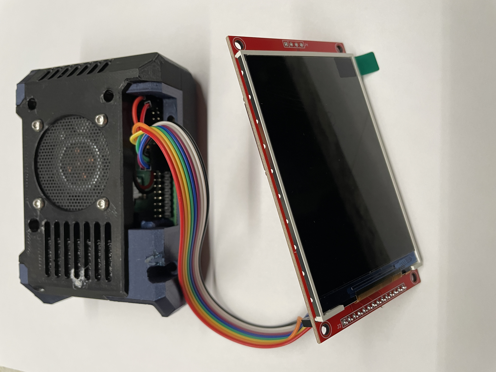

# ILI9488 userspace driver

This repository contains a Linux userspace driver stack for an ILI9488 320x480 SPI display, plus a demo application.

This driver repository is part of a larger ECEN 5713 final project:
[cu-ecen-aeld/final-project-jordankooyman](https://github.com/cu-ecen-aeld/final-project-jordankooyman)



The code is organized as three layers:

1. SPI and GPIO transport layer (`ili9488_spi`)
2. Display command layer (`ili9488_hal`)
3. Framebuffer and drawing layer (`ili9488_gfx`)

The current Linux target is Raspberry Pi with `spidev` and `libgpiod`.

## Current status

What is working now:

- SPI transport over `/dev/spidev0.0`
- GPIO control for reset and D/C over `/dev/gpiochip0`
- ILI9488 initialization and command support in HAL
- In-memory RGB565 framebuffer drawing primitives
- Full and dirty-region framebuffer flush to display
- Built-in 6x8 and 8x12 ASCII fonts
- Demo program with multi-phase animation

What to keep in mind:

- `hal_display_initialize()` currently uses a fixed SPI path (`/dev/spidev0.0`) and 10 MHz write clock in source.
- The demo currently initializes the display in 18-bit transfer mode.
- Runtime hardware access usually requires root (or equivalent udev/group permissions).

## Repository layout

```text
ili9488-userspace-driver/
  include/
    config.h
    ili9488_spi.h
    ili9488_hal.h
    ili9488_gfx.h
    ili9488_fnt.h
  src/
    ili9488_spi.c
    ili9488_hal.c
    ili9488_gfx.c
    ili9488_fnt.c
  demo/
    main.c
    Makefile
  docs/
    wiring.md
    implementation-guide.md
    command-reference.md
    graphics-guide.md
  tests/
    init_test_1.sh
    init_test_2.py
    init_test_3.py
    ESP32_ILI9488_Display_Test/
```

## Hardware setup

The active Linux wiring used by this project:

- SPI device: `/dev/spidev0.0`
- RESET: BCM 24
- D/C: BCM 25
- CS: SPI0 CE0 (hardware-managed by `spidev`)

Full pin mapping is documented in [docs/wiring.md](docs/wiring.md), and can be changed by modifying [include/config.h](include/config.h)

## Build

Build from the demo directory:

```bash
cd demo
make clean
make
```

Output binary:

- `demo/ili9488_demo`

## Run

```bash
cd demo
sudo ./ili9488_demo
```

The demo runs continuously and cycles through:

1. A moving dirty-region rectangle and moving pixel
2. Brief full-screen color fills
3. A center-out starburst line sweep
4. Additional full-screen color fills

## Dependencies

On Debian or Raspberry Pi OS:

```bash
sudo apt update
sudo apt install -y build-essential libgpiod-dev
```

Also ensure SPI is enabled and `/dev/spidev0.0` exists.

## API quick view

Public headers:

- [include/ili9488_spi.h](include/ili9488_spi.h): SPI and GPIO primitives
- [include/ili9488_hal.h](include/ili9488_hal.h): ILI9488 command-level API
- [include/ili9488_gfx.h](include/ili9488_gfx.h): framebuffer and drawing API

Typical application flow:

1. `hal_display_initialize(...)`
2. Create and bind a framebuffer with `gfx_framebuffer_bind(...)`
3. Draw with `gfx_fill`, `gfx_draw_pixel`, `gfx_draw_line`, `gfx_draw_filled_rectangle`, `gfx_draw_string`
4. Push updates with `gfx_flush(...)` or `gfx_flush_dirty(...)`
5. `hal_display_deinitialize()` when done

## Documentation map

- [docs/implementation-guide.md](docs/implementation-guide.md): architecture and module behavior
- [docs/command-reference.md](docs/command-reference.md): HAL command reference
- [docs/graphics-guide.md](docs/graphics-guide.md): graphics and framebuffer usage details
- [docs/wiring.md](docs/wiring.md): Raspberry Pi wiring table

## Notes on tests

The `tests/` directory contains bring-up scripts and reference experiments. The included ESP32 test project is separate from the Linux userspace build and is retained as a hardware validation reference.

## AI usage disclosure

AI tools were used during development and documentation drafting. All generated output was reviewed and edited in-repository, and final behavior is validated by local builds and runtime testing. Conversation logs used during development are stored in [AI_chats](AI_chats).

## License

See [LICENSE](LICENSE).
