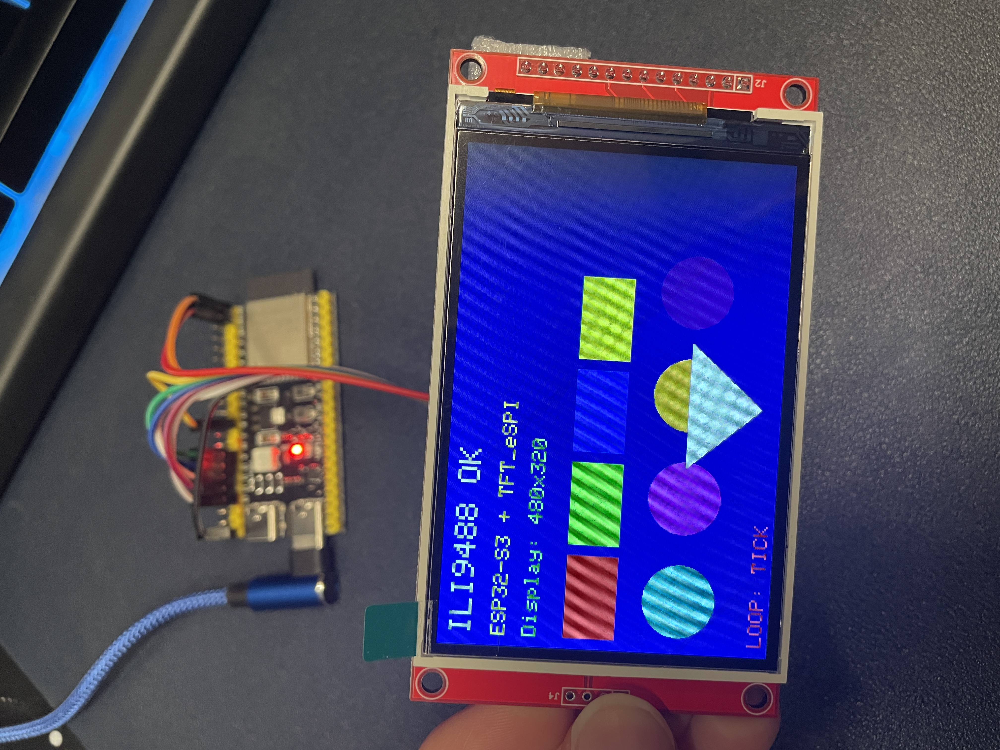

# ILI9488 3.5" SPI LCD Functional Test
## ESP32-S3-WROOM + MSP3521 Display + TFT_eSPI

This guide walks through the complete setup for running a functional display test on a
3.5" SPI LCD module (MSP3521, ILI9488 driver) using an ESP32-S3-WROOM development board
and the TFT_eSPI library in Arduino IDE. By the end you will have confirmed that the
display works and that you have full control over it from your code.

---

## Hardware Required

- ESP32-S3-WROOM development board (with two USB-C ports labeled COM and USB)
- MSP3521 3.5" SPI LCD module (ILI9488 driver, 320x480 resolution)
- 9 x female-to-female jumper wires
- USB-C cable to connect the ESP32-S3 to your PC

---

## Test Setup



---

## Project File Structure

This folder is the complete Arduino sketch project. Copy or move the entire folder
to your Arduino sketchbook directory before opening it in Arduino IDE. The default
sketchbook location is:

- Windows:  Documents\Arduino\
- macOS:    ~/Arduino/
- Linux:    ~/Arduino/

The project folder contains:

```
ILI9488_Test/
    ILI9488_Test.ino
    User_Setup.h
    README.md
    esp32_ili9488_test_setup.jpg
```

The `User_Setup.h` here is a reference copy of the TFT_eSPI configuration used for
this project. TFT_eSPI does not read it from the sketch folder -- you must apply it
to the library directly. See Step 5 for instructions.

---

## Step 1 -- Install Arduino IDE

If you do not already have Arduino IDE installed, download version 2.x from:

    https://www.arduino.cc/en/software

Install it using the default options. No special configuration is needed during
installation.

---

## Step 2 -- Add the ESP32 Board Package

Arduino IDE does not include ESP32 support by default. You need to add it manually.

1. Open Arduino IDE.
2. Go to File > Preferences.
3. Find the field labeled "Additional boards manager URLs".
4. Paste the following URL into that field:

```
https://raw.githubusercontent.com/espressif/arduino-esp32/gh-pages/package_esp32_index.json
```

   If there are already other URLs in that field, add a comma after the last one
   and then paste the new URL.

5. Click OK.
6. Go to Tools > Board > Boards Manager.
7. In the search box, type: esp32
8. Find the entry titled "esp32" with the author listed as "Espressif Systems".
9. Click Install. This download is approximately 300 MB so it may take several minutes.
10. Once installation is complete, close the Boards Manager.

---

## Step 3 -- Select the Correct Board

1. Go to Tools > Board > esp32.
2. Select "ESP32S3 Dev Module" from the list.
3. Configure the remaining settings under the Tools menu as follows:

| Setting        | Value                    |
|----------------|--------------------------|
| USB Mode       | Hardware CDC and JTAG    |
| Flash Size     | 8MB (match your module)  |
| PSRAM          | Disabled                 |
| Upload Speed   | 921600                   |

---

## Step 4 -- Install the TFT_eSPI Library

1. Go to Sketch > Include Library > Manage Libraries.
2. In the search box, type: TFT_eSPI
3. Find the entry titled "TFT_eSPI" by Bodmer.
4. Click Install.
5. Close the Library Manager.

---

## Step 5 -- Apply the TFT_eSPI Configuration

TFT_eSPI requires you to configure which display driver and which GPIO pins you are
using. This is done by editing the `User_Setup.h` file inside the library folder.

Navigate to the library folder and open `User_Setup.h` in any text editor:

- Windows:  Documents\Arduino\libraries\TFT_eSPI\User_Setup.h
- macOS:    ~/Arduino/libraries/TFT_eSPI/User_Setup.h
- Linux:    ~/Arduino/libraries/TFT_eSPI/User_Setup.h

Find and comment out or delete all existing `#define` lines for drivers and pins,
then paste in the following block. The reference copy of this file in the project
folder contains the same content.

```cpp
// ==========================================
// Driver Selection
// ==========================================
#define ILI9488_DRIVER

// ==========================================
// Pin Definitions
// ==========================================
#define TFT_MOSI 11
#define TFT_MISO 13
#define TFT_SCLK 12
#define TFT_CS   10
#define TFT_DC    9
#define TFT_RST   8

// ==========================================
// SPI Bus Selection
// Required for ESP32-S3 -- maps to SPI2
// ==========================================
#define USE_HSPI_PORT

// ==========================================
// Fonts
// ==========================================
#define LOAD_GLCD
#define LOAD_FONT2
#define LOAD_FONT4
#define LOAD_FONT6
#define LOAD_FONT7
#define LOAD_FONT8
#define LOAD_GFXFF
#define SMOOTH_FONT

// ==========================================
// SPI Speed
// ==========================================
#define SPI_FREQUENCY       20000000
#define SPI_READ_FREQUENCY  16000000
#define SPI_TOUCH_FREQUENCY  2500000
```

Save the file. If you ever reinstall or update the TFT_eSPI library, you will need
to reapply these settings from the reference copy in this project folder.

---

## Step 6 -- Wiring the Display

The MSP3521 display communicates with the ESP32-S3 over SPI. Use female-to-female
jumper wires to connect the display pins to the ESP32-S3 GPIO header as shown below.

The display uses 3.3V logic. Do not connect any display pin to a 5V source or you
risk damaging the display.

### Pin Connections

| Display Pin | Display Label | ESP32-S3 Connection | Notes                                  |
|-------------|---------------|---------------------|----------------------------------------|
| 1           | VCC           | 3.3V                | Power -- use 3.3V only                 |
| 2           | GND           | GND                 | Ground                                 |
| 3           | CS            | GPIO 10             | SPI Chip Select                        |
| 4           | RESET         | GPIO 8              | Display Reset                          |
| 5           | DC/RS         | GPIO 9              | Data / Command select                  |
| 6           | SDI (MOSI)    | GPIO 11             | SPI data from ESP32 to display         |
| 7           | SCK           | GPIO 12             | SPI clock                              |
| 8           | LED           | 3.3V                | Backlight -- tie to 3.3V for always-on |
| 9           | SDO (MISO)    | GPIO 13             | SPI data from display to ESP32         |

Any pins on the display labeled with a "T_" prefix (such as T_CS, T_IRQ, T_MOSI,
T_MISO, T_CLK) are for the resistive touchscreen controller and are not used in
this test. Leave them unconnected.

### Double-Check Before Powering On

- VCC must go to 3.3V, not 5V.
- GND on the display must connect to GND on the ESP32-S3.
- The LED (backlight) pin must be connected to 3.3V or the screen will stay dark.
- Verify that MOSI, MISO, and SCK are not swapped.

---

## Step 7 -- Connect the ESP32-S3 to Your PC

Your ESP32-S3 development board has two USB-C ports:

- The port labeled COM connects through a USB-to-UART bridge chip. Use this port
  for uploading sketches and viewing the Serial Monitor in Arduino IDE. This is the
  correct port for all normal development work.

- The port labeled USB connects directly to the ESP32-S3's internal USB core. This
  port is used for advanced USB device projects and is not needed for this test.

Plug a USB-C cable from the COM port on the board to your PC.

### Selecting the Port in Arduino IDE

1. Go to Tools > Port.
2. Select the port that appears when your board is connected. On Windows it will
   appear as COMx (for example, COM5). On macOS and Linux it will appear as
   /dev/ttyUSBx or /dev/ttyACMx.

If no port appears, install the USB-to-UART bridge driver for your board. Common
chips used are the CH340 and CP2102. Search for the chip name plus "driver" to
find the installer from the manufacturer.

### If Upload Fails

If Arduino IDE cannot upload to the board, enter bootloader mode manually:

1. Hold the BOOT button on the board.
2. While holding BOOT, press and release the RST button.
3. Release BOOT.
4. Click Upload in Arduino IDE.
5. Once upload is complete, press RST once to start running the sketch.

---

## Step 8 -- Upload and Run

1. Open ILI9488_Test.ino in Arduino IDE.
2. Confirm the correct board and port are selected under the Tools menu.
3. Click Upload (the right-arrow button, or Sketch > Upload).
4. Wait for the upload to complete. The status bar will say "Done uploading."
5. The display should immediately begin cycling through the test phases.

To view debug output, open the Serial Monitor (Tools > Serial Monitor) and set
the baud rate to 115200. You will see each phase printed as it runs, followed by
"Tick" and "Tock" messages once per second from the loop.

---

## Expected Test Behavior

| Phase   | What You Should See                                                  |
|---------|----------------------------------------------------------------------|
| Phase 1 | Display fills with each solid color in sequence with the name shown  |
| Phase 2 | Black screen with a grey grid of lines                               |
| Phase 3 | Navy screen with white text, colored rectangles, circles, triangle   |
| Loop    | "LOOP: TICK" and "LOOP: TOCK" alternating every second               |

---

## Troubleshooting

| Symptom                            | Likely Cause and Fix                                                                                          |
|------------------------------------|---------------------------------------------------------------------------------------------------------------|
| Screen is all white or all black   | DC or CS pin is wrong or floating -- recheck wiring                                                           |
| Garbled colors or streaks          | MOSI and SCLK may be swapped, or SPI speed too high -- try setting SPI_FREQUENCY to 10000000 in User_Setup.h |
| Image is mirrored or sideways      | Change the argument to tft.setRotation() from 1 to 0, 2, or 3                                                |
| Backlight is off, no image         | LED pin not connected to 3.3V -- check that wire                                                              |
| Backlight on but screen is dark    | RST pin issue -- verify GPIO 8 is connected to RESET on display                                               |
| Crash with "Guru Meditation Error" | USE_HSPI_PORT is missing from User_Setup.h in the library folder                                              |
| Compile error about driver         | Another driver define is still active in User_Setup.h -- remove all other #define XXX_DRIVER lines            |
| No COM port visible in Arduino     | Install the USB-to-UART bridge driver for your board (CH340 or CP2102)                                        |

---

## Library and Board Package Versions

| Component          | Version Used     |
|--------------------|------------------|
| Arduino IDE        | 2.3.8            |
| esp32 by Espressif | 3.3.7            |
| TFT_eSPI by Bodmer | 2.5.43           |

---

## Hardware Reference

| Component | Description                                      |
|-----------|--------------------------------------------------|
| MCU Board | ESP32-S3-WROOM development board                 |
| Display   | MSP3521 3.5" SPI LCD, 320x480, ILI9488 driver    |
| Interface | SPI (4-wire with CS, DC, and RST control lines)  |
| Logic     | 3.3V                                             |